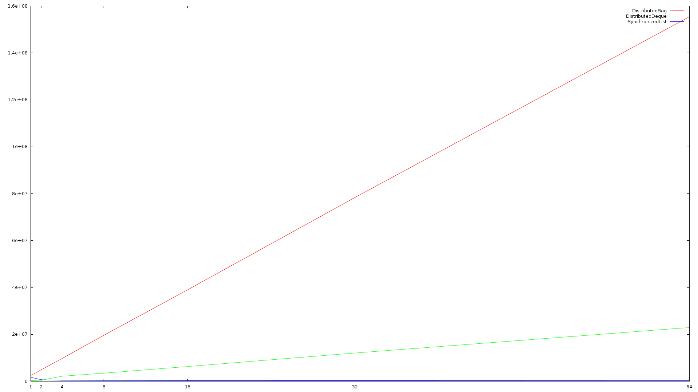

# Distributed Data Structures

This repository hosts the first framework for distributed data structures for the
Chapel programming language. Here we introduce a 'Collections API', based on Java's
Collections framework, as well as some data structures, some distributed, others
local.

## Performance Testing

All benchmarks performed on a Cray-XC40 cluster.

## Queues

Provides a strict FIFO ordering without sacrificing too much performance. The FIFO ordering
is preserved across all nodes in a cluster, and employs a wait-free round-robin approach
to load distribution that ensures fairness in memory, bandwidth, and computation.

### Performance

We compare our queues to a naive synchronized list implementation as that is all that
is available.

#### Enqueue

#### Dequeue

TODO

## Multiset

Does not provide any ordering whatsoever in favor of performance.

### Performance

#### Add

TODO

#### Remove

TODO
